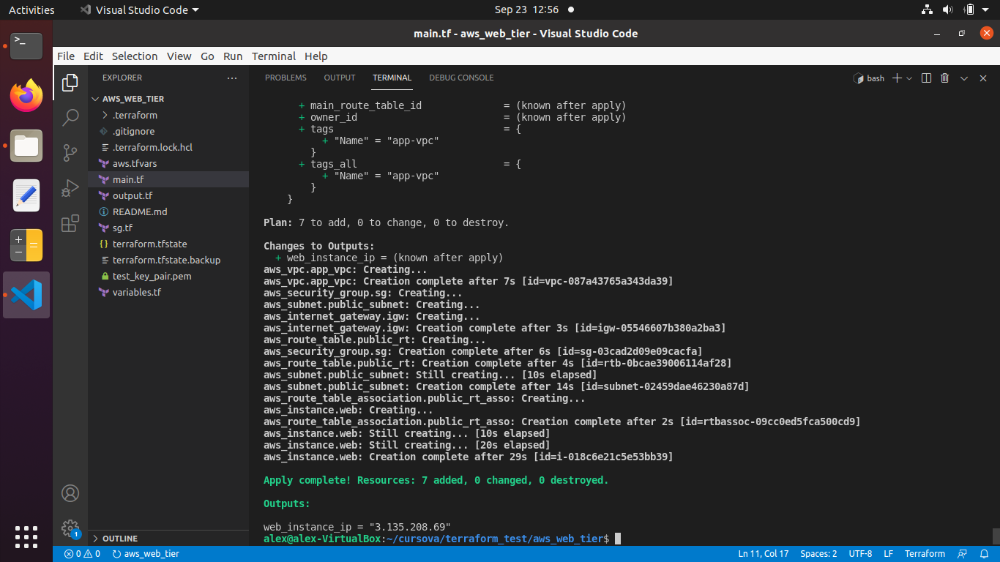
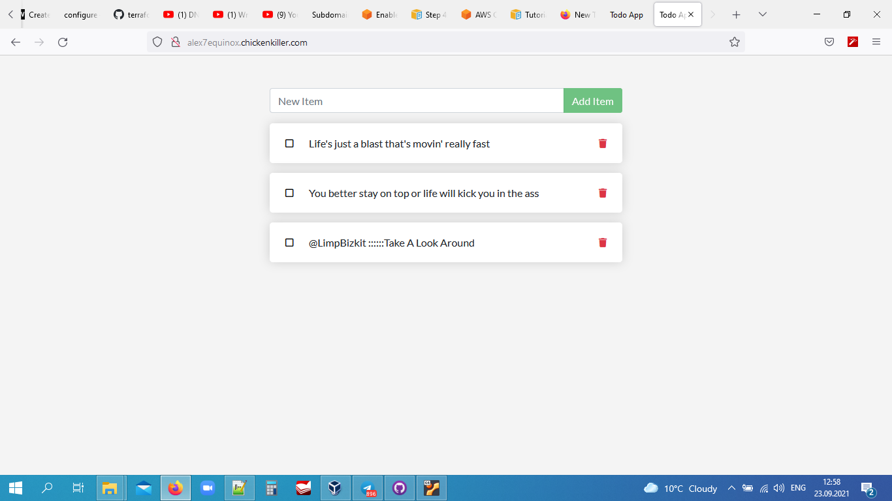

# Olexiy Bahirev's Graduate Work
- ### I created an automation deployment of web application that consist of two containerized microservices (node web server + mysql database).
- ### The application hosts on AWS EC2 instance. 
- ### To automate infrastructure deployment I used infrastructure as code (IaC) software tool Terraform
- ### I used Docker Compose to define and spin up my multi-container application
- ### Also I wrote a bash script to bundle all together and automate application deployment during EC2 instance creation in Terraform
- ### For safely store and using my AWS Access_Keys I used  AWS CLI tool
- ### The necessary Docker images was uploaded to my repo on Docker Hub
- ### GitHub was used for hosting my App Repo that is been downloading during script exucution in ```user_data`` section in Terraform ( https://github.com/AlexEquinox/app_cursova.git )
- ### freeDNS service was used to obtain a DNS-name ( http://alex7equinox.chickenkiller.com = 3.135.208.69 IP) 

## The goal 
- The main goal of the project was to make an automation (aka DevOps) of a whole deployment proccess. And it was achived: everything is launching by only hitting one key  after ``` teraform apply ``` command. 

## The resources I have used to mix and assemble my project
- Simple multi container app example:
https://docs.docker.com/get-started/07_multi_container/
- Exapmle deployment of Apache Web Server in AWS Using Terraform https://dev.to/chefgs/create-apache-web-server-in-aws-using-terraform-1fpj#install-and-configure-aws-cli
- AWS CLI Command Reference https://awscli.amazonaws.com/v2/documentation/api/latest/reference/configure/index.html

## Code Snippets:
- ### docker-compose.yml file:
```sh
version: "3.7"

services:
  app:
    image: alex7equinox/node:12-alpine
    command: sh -c "yarn install && yarn run dev"
    ports:
      - 80:3000
    working_dir: /app
    volumes:
      - ./:/app
    environment:
      MYSQL_HOST: mysql
      MYSQL_USER: root
      MYSQL_PASSWORD: secret
      MYSQL_DB: todos

  mysql:
    image: alex7equinox/mysql:5.7
    volumes:
      - todo-mysql-data:/var/lib/mysql
    environment:
      MYSQL_ROOT_PASSWORD: secret
      MYSQL_DATABASE: todos

volumes:
  todo-mysql-data:
```
- ### Bash script in ```user_data```:
(I was forced to add ```sleep``` pauses because without them the ```docker-compose up``` command was ending up with error (```docker-compose logs -f``` execution log) trying to connect the node and mysql containers into single network)
```sh
#!/bin/bash

sudo apt-get update -y

sleep 10s

#install Docker with convenience script

curl -fsSL https://get.docker.com -o get-docker.sh
sudo sh get-docker.sh

sleep 1m

#install Docker Compose

sudo curl -L "https://github.com/docker/compose/releases/download/1.29.2/docker-compose-$(uname -s)-$(uname -m)" -o /usr/local/bin/docker-compose
sudo chmod +x /usr/local/bin/docker-compose

sleep 15s

#clone app repository with docker-compose.yml file, and then change directory to the app

git clone https://github.com/AlexEquinox/app_cursova.git
cd app_cursova/app

#start deploying application with docker-compose.yml (port 80)
sudo  docker-compose up -d
sleep 15s
```
- ### main.tf Terraform file:
```sh
terraform {
  required_providers {
    aws = {
      source  = "hashicorp/aws"
      version = "~> 3.0"
    }
  }
}

# Configure the AWS Provider
provider "aws" {
  region = var.region
  shared_credentials_file = var.creds
  profile = "default"
}

# Create a VPC
resource "aws_vpc" "app_vpc" {
  cidr_block = var.vpc_cidr

  tags = {
    Name = "app-vpc"
  }
}

resource "aws_internet_gateway" "igw" {
  vpc_id = aws_vpc.app_vpc.id

  tags = {
    Name = "vpc_igw"
  }
}

resource "aws_subnet" "public_subnet" {
  vpc_id            = aws_vpc.app_vpc.id
  cidr_block        = var.public_subnet_cidr
  map_public_ip_on_launch = true
  availability_zone = "us-east-2a"

  tags = {
    Name = "public-subnet"
  }
}

resource "aws_route_table" "public_rt" {
  vpc_id = aws_vpc.app_vpc.id

  route {
    cidr_block = "0.0.0.0/0"
    gateway_id = aws_internet_gateway.igw.id
  }

  tags = {
    Name = "public_rt"
  }
}

resource "aws_route_table_association" "public_rt_asso" {
  subnet_id      = aws_subnet.public_subnet.id
  route_table_id = aws_route_table.public_rt.id
}

resource "aws_instance" "web" {
  ami           = "ami-00399ec92321828f5" 
  instance_type = var.instance_type
  key_name = var.instance_key
  subnet_id              = aws_subnet.public_subnet.id
  security_groups = [aws_security_group.sg.id]

  user_data = <<-EOF
  #!/bin/bash
  sudo apt-get update -y
  sleep 10s
  #install Docker with convenience script
  curl -fsSL https://get.docker.com -o get-docker.sh
  sudo sh get-docker.sh
  sleep 1m
  #install Docker Compose
  sudo curl -L "https://github.com/docker/compose/releases/download/1.29.2/docker-compose-$(uname -s)-$(uname -m)" -o /usr/local/bin/docker-compose
  sudo chmod +x /usr/local/bin/docker-compose
  sleep 15s
  #clone app repository with docker-compose.yml file, and then change directory to the app
  git clone https://github.com/AlexEquinox/app_cursova.git
  cd app_cursova/app
  #start deploying application with docker-compose.yml (port 80)
  sudo  docker-compose up -d
  sleep 15s
  EOF

  tags = {
    Name = "web_instance"
  }

  volume_tags = {
    Name = "web_instance"
  } 
}
```

## ScreenShots




