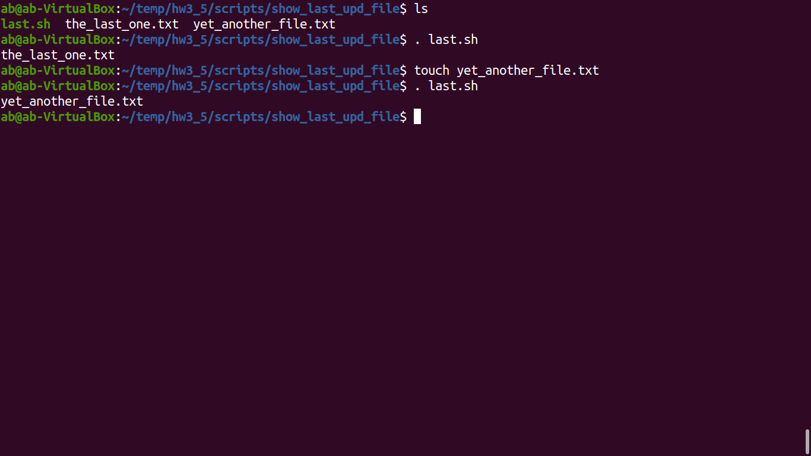
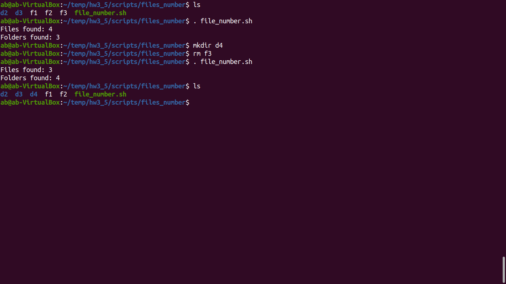
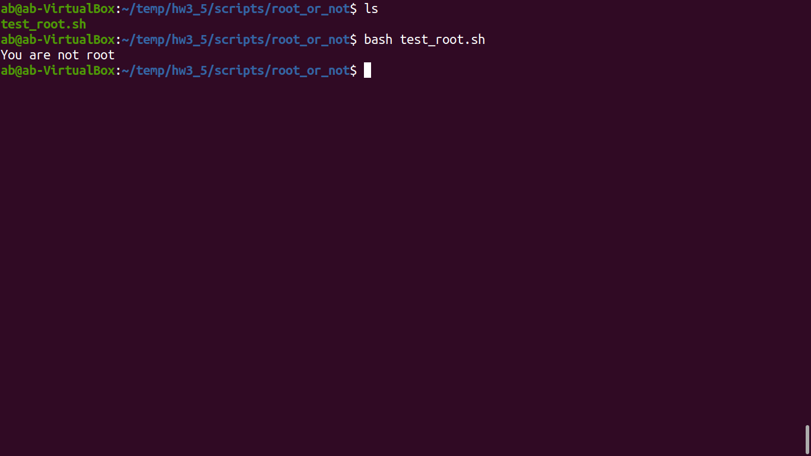

# HOME WORK 3.5 (Scripts)

## Script 1
## _Show the last changed file in current directory_
```sh
1 #!usr/bin/bash
2
3 ls -lrt | grep ^- | awk 'END{print $NF}'
```


## Script 2
## _Show summary number of files in current directory_
```sh
 1 #!usr/bin/bash
 2
 3 if [ -d "$@" ]; then
 4 echo "Files found: $(find "$@" -type f | wc -l)"
 5 echo "Folders found: $(find "$@" -type d | wc -l)"
 6 else
 7 echo "[ERROR] Please retry with another folder."
 8 exit 1
 9 fi
```



## Script 3
## _Show is the current user a root or not_
```sh
1 #!usr/bin/bash
 2
 3 ROOT_UID=0
 4
 5 if [ "$UID" -eq "$ROOT_UID" ]
 6 then
 7 echo "You are root."
 8 else
 9 echo "You are not root"
10 fi
```

