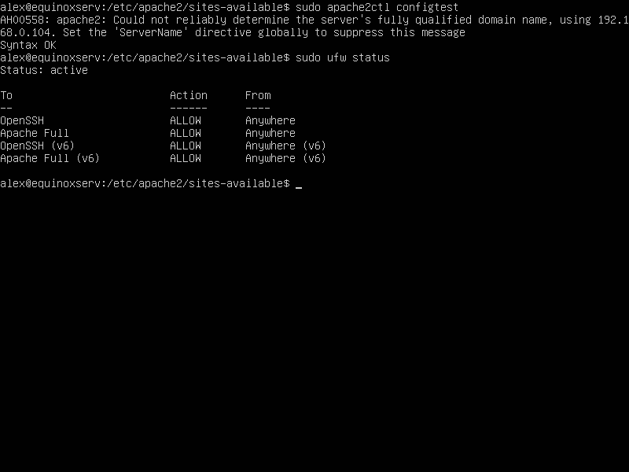
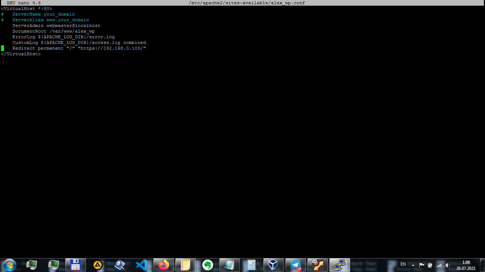
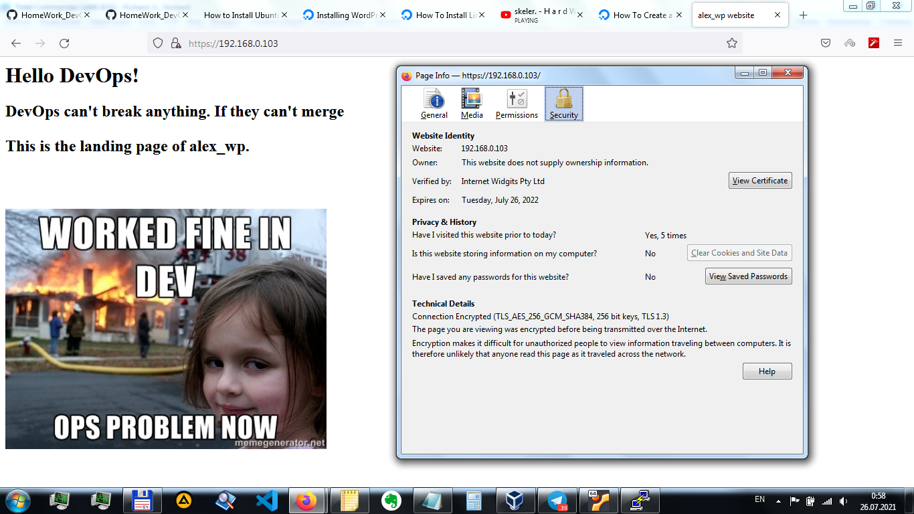
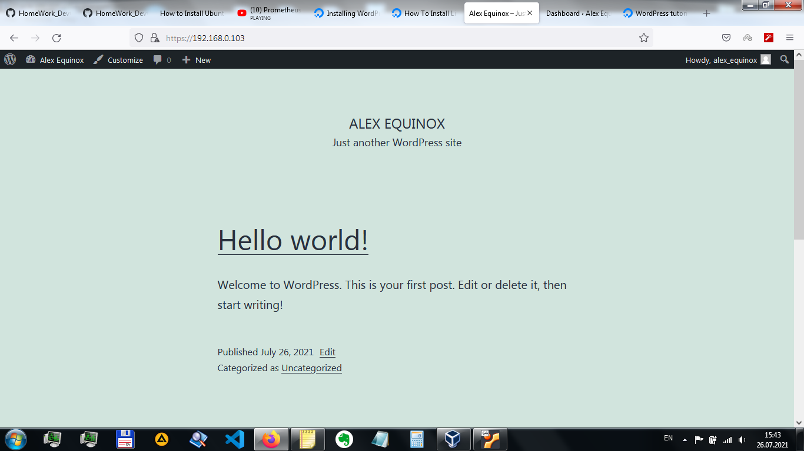

# HOME WORK #5-6
## _Install Apache and adjust firewall settings to allow both HTTP(port 80) and HTTPS(port 443) traffic_
```sh
sudo apt update
sudo apt install apache2
sudo ufw allow in "Apache Full"
sudo ufw status
```




## _Creating a virtual host for Wordpress_
```sh
sudo mkdir /var/www/alex_wp
sudo chown -R $USER:$USER /var/www/alex_wp
```

## _Create a new configuration file in Apache’s sites-available directory_
```sh
sudo nano /etc/apache2/sites-available/alex_wp.conf
```
Configure permanent redirection to https for SSL:
```sh
DocumentRoot /var/www/alex_wp
...
Redirect permanent "/" "https://192.168.0.103/"
```

- 1 Disable the default website that comes installed with Apache (without custom domain name Apache’s default configuration would overwrite my **alex_wp** virtual host)
- 2 check for syntax errors
- 3 reload Apache
```sh
1 sudo a2dissite 000-default
2 sudo apache2ctl configtest
3 sudo systemctl reload apache2
```
### _Finally make some changes in /var/www/alex_wp/index.html file_
```sh

```


## _Install Wordpress_
```sh
CREATE DATABASE wordpress DEFAULT CHARACTER SET utf8 COLLATE utf8_unicode_ci;
CREATE USER 'wordpressuser'@'%' IDENTIFIED WITH mysql_native_password BY 'password';
GRANT ALL ON wordpress.* TO 'wordpressuser'@'%';
FLUSH PRIVILEGES;
EXIT;

sudo apt update
sudo apt install php-curl php-gd php-mbstring php-xml php-xmlrpc php-soap php-intl php-zip
sudo systemctl restart apache2
...
# Allow for .htaccess Overrides and Rewrites in /etc/apache2/sites-available/alex_wp.conf
...
cd /tmp
curl -O https://wordpress.org/latest.tar.gz
tar xzvf latest.tar.gz
touch /tmp/wordpress/.htaccess
cp /tmp/wordpress/wp-config-sample.php /tmp/wordpress/wp-config.php
sudo cp -a /tmp/wordpress/. /var/www/alex_wp
sudo chown -R www-data:www-data /var/www/alex_wp
sudo find /var/www/alex_wp/ -type d -exec chmod 750 {} \;
sudo find /var/www/alex_wp/ -type f -exec chmod 640 {} \;
...
# redirect keys to the aimed file
sudo curl -s https://api.wordpress.org/secret-key/1.1/salt/ >> /var/www/alex_wp/wp-config.php
# then edit the wp-config.php file in nano
...
```
## _Completing the Installation Through the Web Interface_

