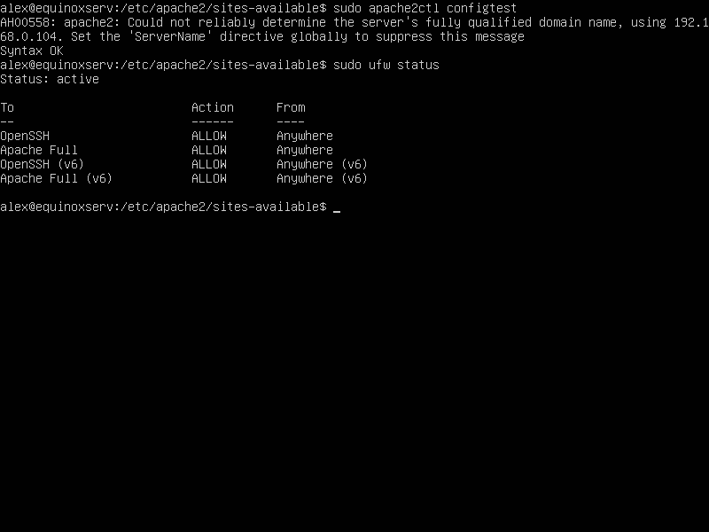
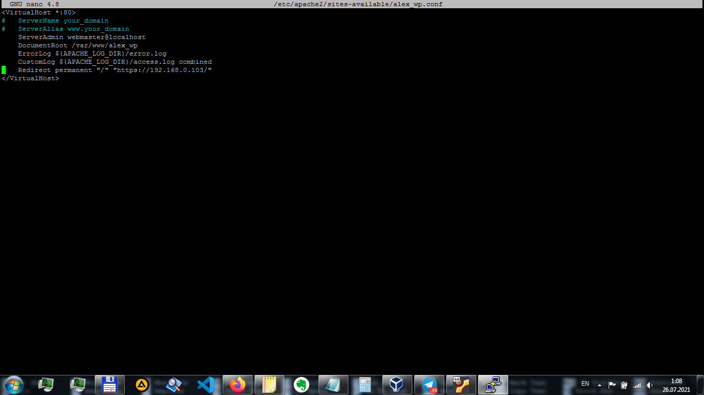

# HOME WORK #5
## _Install Apache and adjust firewall settings to allow both HTTP(port 80) and HTTPS(port 443) traffic_
```sh
sudo apt update
sudo apt install apache2
sudo ufw allow in "Apache Full"
sudo ufw status
```




## _Creating a virtual host for Wordpress_
```sh
sudo mkdir /var/www/alex_wp
sudo chown -R $USER:$USER /var/www/alex_wp
```

## _Create a new configuration file in Apache’s sites-available directory_
```sh
sudo nano /etc/apache2/sites-available/alex_wp.conf
```
Configure permanent redirection to https for SSL:
```sh
DocumentRoot /var/www/alex_wp
...
Redirect permanent "/" "https://192.168.0.103/"
```

