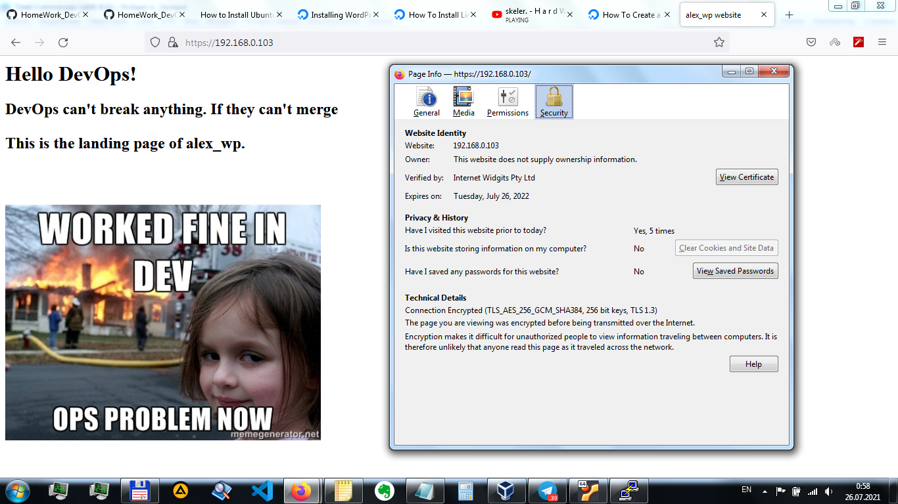

# HOME WORK #5-6
## _Install Apache and adjust firewall settings to allow both HTTP(port 80) and HTTPS(port 443) traffic_
```sh
sudo apt update
sudo apt install apache2
sudo ufw allow in "Apache Full"
sudo ufw status
```


## _Creating a virtual host for Wordpress_

sudo mkdir /var/www/alex_wp
sudo chown -R $USER:$USER /var/www/alex_wp
```

## _Create a new configuration file in Apache’s sites-available directory_
```sh
sudo nano /etc/apache2/sites-available/alex_wp.conf
```
Configure permanent redirection to https for SSL:
```sh
DocumentRoot /var/www/alex_wp
...
Redirect permanent "/" "https://192.168.0.103/"
```

- 1 Disable the default website that comes installed with Apache (without custom domain name Apache’s default configuration would overwrite my **alex_wp** virtual host)
- 2 check for syntax errors
- 3 reload Apache
```sh
1 sudo a2dissite 000-default
2 sudo apache2ctl configtest
3 sudo systemctl reload apache2
```
## _Finally make some changes in /var/www/alex_wp/index.html file_
```sh

```


```sh
```
