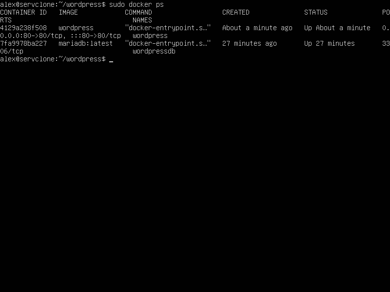

# HOME WORK #7-7.5
## _Create MariaDB and Wordpress containers_
```sh
docker run -e MYSQL_ROOT_PASSWORD=<password> -e MYSQL_DATABASE=wordpress --name wordpressdb -v "$PWD/database":/var/lib/mysql -d mariadb:latest
docker run -e WORDPRESS_DB_USER=root -e WORDPRESS_DB_PASSWORD=<password> --name wordpress --link wordpressdb:mysql -p 80:80 -v "$PWD/html":/var/www/html -d wordpress
```


*****************************************************************
[✨✨✨✨✨✨ КОНСПЕКТ 7-7.5 ✨✨✨✨✨✨](./conspect.txt)
*****************************************************************
